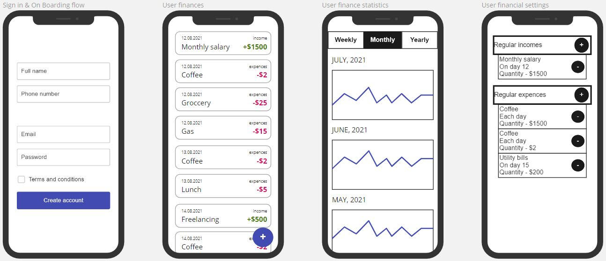

# ok-202105-finrec-do
Учет финансов, Овсяник Дмитрий
FinTrack - приложение для учета и мониторинга личных финансов. Учет доходов, расходов, получение предупреждений о перерасходе средств, получение предложений для инвестирования или займа денежных средств. Информация о перерасходе средств или об остатке средств на конец периода может быть использована для предложений пользователю релевантной рекламы (кредитование, инвестирование, товары). Информация, введенная пользователями, (обязательно без привязки к конкретному пользователю) может быть продана в качестве статистических данных финансовым учреждениям. Для дальнейшего развития в планах реализовать не только доход и расход, но и внесения данных по кредиту или депозиту для учета в статистике и предложениях.
## Маркетинг приложения
Целевая аудитория - это работаючее население, предположительно семейное, которые стремятся контролировать своё финансовое состояние каждый день.
### Гипотетический портрет пользователя
1. Мужчины или женщины
2. от 25 до 50 лет
3. С высшим или неоконченным высшим образованием
4. С уровнем достатка выше среднего и ниже
## Описание MVP

### Функции (эндпониты)
1. CRUDS (create, read, update, delete, search) для финансовой операции (доход или расход) (fin_operation)
2. CRUDS (create, read, update, delete, search) регулярных для финансовой операции (доход или расход) (regular_fin_operation) (опционально)
3. Выборка статистики по всем пользователям с фильтрацией, сортировкой и аналитикой (опционально)
### Описание сущности fin_operation
1. Name
2. Description (optional)
3. Date
4. Time (optional)
5. OperationType (enum)
6. Amount
7. Currency
### Enum OperationType
1. Income
2. Outcome
### Описание сущности regular_fin_operation
1. Name
2. Description (optional)
3. DateInfo
    1. RegularityType (enum)
    2. Day (for Daily type can be omitted)
    3. Time
4. OperationType (enum)
5. Amount
6. Currency
### Enum RegularityType
1. Daily
2. Weekly
3. Monthly
4. Yearly
# Структура проекта
## Транспортные модели, API

## Фреймворки и транспорты

## Модули бизнес-логики

## Хранение, репозитории, базы данных
